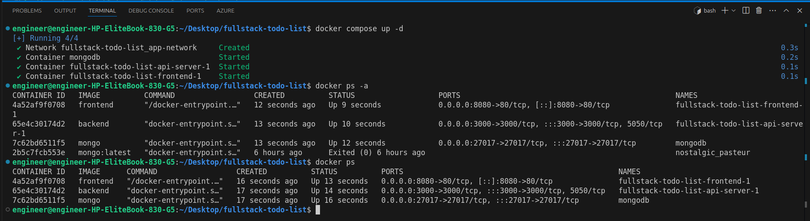
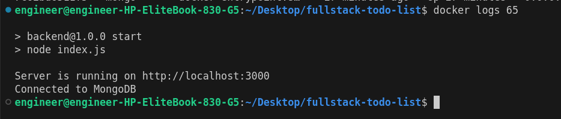
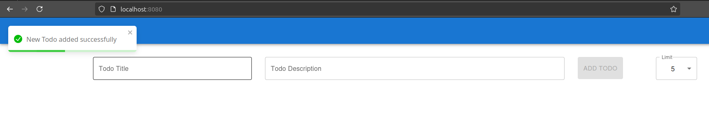
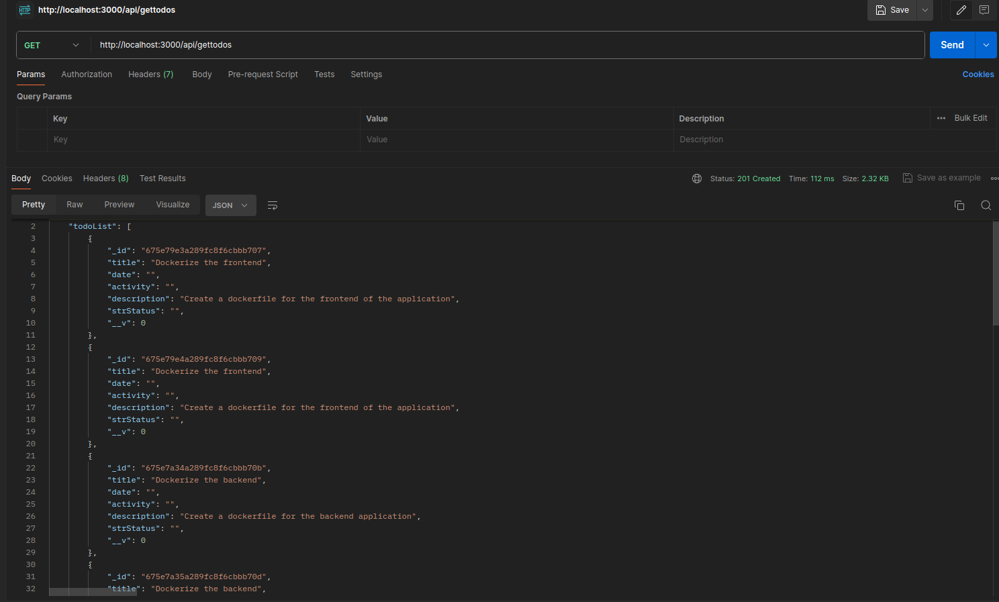
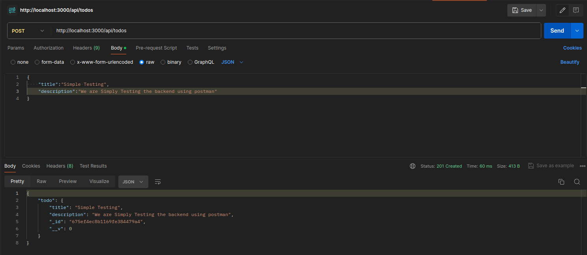
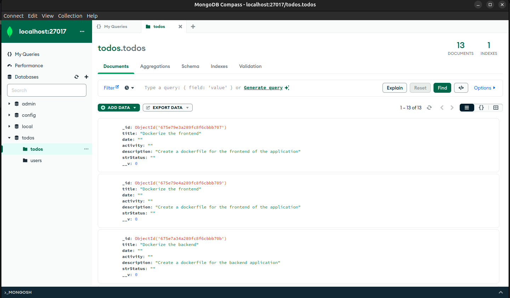
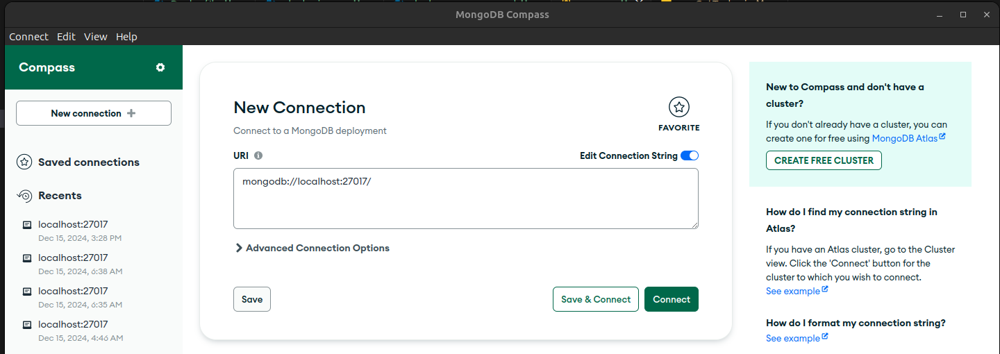

# Cloud Engineering Pathway Assessment

## Table of Contents

1. [Dockerfile(s) for Each Component]
2. [Docker Compose File]
3. [Documentation]

- Prerequisite
- Setup Instruction
- [Network and Security Configurations]
- [Troubleshooting Guide]
- [Container Testing Script]

---

## Dockerfile(s) for each Component

### Backend Docker file

Create a `Dockerfile` in the Backend directory and past this code

```docker
dockerfile
# Use Node.js base image
FROM node:18-alpine

# Set working directory
WORKDIR /usr/src/app

# Copy package files and install dependencies
COPY package*.json ./
RUN npm install

# Copy application code
COPY . .

# Expose backend API port
EXPOSE 3000

# Start the backend server
CMD ["npm", "start"]
```

### Frontend Docker file

Create a `Dockerfile` in the Frontend directory and past this code

```docker
FROM node:latest as builder

WORKDIR /usr/src/app

COPY package*.json ./

RUN npm ci

COPY . .

RUN npm run build

FROM nginx:1.25.2-alpine-slim

COPY --from=builder /usr/src/app/dist /usr/share/nginx/html

# Expose the default Nginx port
EXPOSE 80

# Start Nginx
CMD ["nginx", "-g", "daemon off;"]

```

The mongodb service use an officail Docker image. No custom `Dockerfile` is required for this component.

We should also create .`dockerignore` file in the each of the directory to ensure we only the necessary files to our docker container 

```docker
# Node.js specific
node_modules
npm-debug.log

# Environment files
.env

# Logs
logs
*.log

# OS-generated files
.DS_Store
Thumbs.db

# Temporary files
*.tmp
*.swp

```

### Docker Compose File

This docker compose file is placed in the root of the folder structure of the application

```yaml
services:
  frontend:
    image: frontend
    build:
      context: ./Frontend
    ports:
      - "8080:80"
    depends_on:
      - api-server
    networks:
      - app-network
    restart: always

  api-server:
    image: backend
    build:
      context: ./Backend
    ports:
      - 3000:3000
    env_file:
      - ./Backend/.env
    depends_on:
      - mongodb
    networks:
      - app-network
    restart: always

  mongodb:
    image: mongo
    container_name: mongodb
    ports:
      - 27017:27017
    environment:
      - MONGO_INITDB_ROOT_USERNAME:root
      - MONGO_INITDB_ROOT_PASSWORD:example
    volumes:
      - mongo-data:/data/db
    networks:
      - app-network
    restart: always

networks:
  app-network:
    driver: bridge

volumes:
  mongo-data:

```

### Documentation

### Prerequisites

Ensure you have the following tools installed on your local machine:

- Docker (version 20.x or later)
- Docker Compose (version 2.x or later)
- Node.js (for running the application locally)
- Git (for cloning the repository)

### Setup Instructions

1. Clone the Repository. Before cloning the repo make sure you fork the original repo on git hub

```bash
git clone https://github.com/azumahjoshua/fullstack-todo-list.git
cd fullstack-todo-list
```

1. Set Up Environment Variables: Create a `.env` file in the backend directory with the following content:

```docker
MONGODB_URI=mongodb://mongodb:27017/todo
```

1. Build and Start Containers in the background:

```docker
docker compose up -d
```



### Network and Security Configurations

1. **Custom Docker Network**:
    - The services in this project are connected via a custom Docker network named `app-network`.
    - This network is of type **bridge**, which allows the containers to communicate with each other while isolating them from external systems unless explicitly exposed.
    - Using a custom network ensures that containers can resolve each other by their service names (e.g., `mongodb`, `api-server`, `frontend`) without hardcoding IP addresses.
2. **Exposed Ports**:
    
    Each service has specific ports exposed to facilitate communication and access.
    
    - **Frontend**: Exposes port `8080` to make the web application accessible via the host machine.
    - **Backend API**: Exposes port `3000` to allow interaction with the REST API for the frontend and testing tools.
    - **MongoDB**: Exposes port `27017`, but it is only accessible within the `app-network` to enhance security. This ensures the database cannot be accessed directly from outside unless explicitly configured.
3. **Environment Variables for Sensitive Data**:
    - Example environment variables:
        - Database credentials, and any other sensitive information are stored in an `.env` file instead of hardcoding them into the application.
    

### Troubleshooting Guide

1.  Run `docker logs <container-id>` to debug



### Container Testing Script

### Verify Each Service

### **Frontend**

To test if the frontend service is running and accessible: we will use postmand:

```docker
http://localhost:8080/
```



---

### Backend

To test if the backend service is running and accessible:

```docker
http://localhost:3000/api/todos
```



```docker
http://localhost:3000/api/gettodos
```



---

### MongoDB

To verify that the MongoDB  container is running and accessible: we will use MongoDB Compass

```bash
mongodb://localhost:27017/
```





### **Summary**

This testing script verifies that:

- The **frontend** is accessible and serves the UI.
- The **backend API** endpoints are functional and return the expected responses.
- The **MongoDB service** is running and storing the application data.
- **Network communication** between containers is functional.